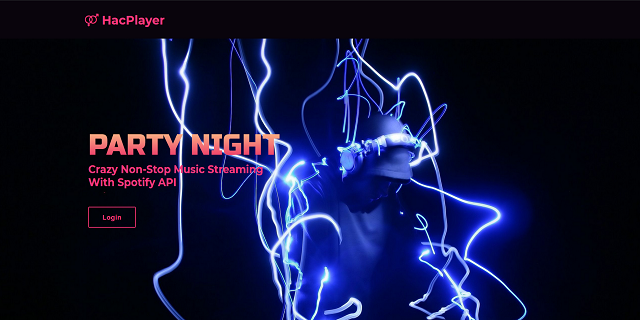

# HacPlayer-spotify-api-music-player
This Music Player i.e. HacPlayer is part of my Real world JS implementation and is created to understand all the functionalities of API.




# Core Features of web player
1. User Authorisation for access token
2. Fetch songs from New Released albums.
3. Get user's all devices details.
4. Get user's all playlists.
5. Get user's playlists tracks.
6. Get user's Album.
7. An inbuit player for playing songs.


# Updates
1.0 - Above features available.
1.1 - Comming Soon...
1.2 - Comming Soon...
2.0 - Comming Soon...

# Forking and Cloning 
- To fork this repository just click on button fork shown above.
- To Clone this repository follow steps below :
   ```
   click on code button then copy the url
   Run - git clone https://repository_url.com/clone   (change this url with the url you got from code).
   And you have successfully cloned this repository.
   ```
   
# Star this repository if you like my work. 
# Thanks!
